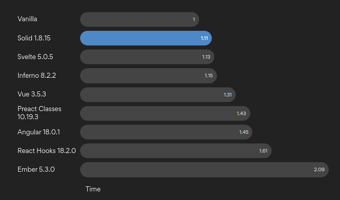

<picture>
    <source media="(prefers-color-scheme: dark)" srcset="assets/HaloJS-header.png">
    
</picture>

# What is HaloJS?

> Currently at concept and implementation research phase. Issues and contributions are welcome.

HaloJS is a front-end framework with minimalistic syntax designed to make the right way the easy way. HaloJS combines the best parts of React, Vue, Solid and Qwik to create a framework that does not sacrifice developer experience for the sake of being performant and vice versa.

HaloJS was designed as a TypeScript-first framework and JSX superset. It introduces new syntax as minimally as possible, while making code as clean and readable as theoretically possible. It allows new developers and LLMs to write code even without understanding of the framework.

I designed HaloJS as a cry from the heart after noticing how each day new "most performant" frameworks appear, finding new ways to make code uglier and harder to read. This is my attempt to create a framework that is performant and developer-friendly in one.

## Features

- Reactive State Management - Built-in lazy reactivity without any prefixes or syntax.
- Component-Based Architecture - Clean, reusable components with props and children
- JSX-like Syntax - Familiar templating with the ability to write regular JS inside of markdown.
- Performance - Best performance based on SolidJS core.
- TypeScript Support - Full TypeScript integration with type checking even for reactivity.
- SSR first - First class support with lazy loaded SSR components.
- Jest/Vitest Support - First class support for testing.

### Planned

- VSCode Integration - Rich editor support with diagnostics, syntax highlighting, and IntelliSense
- Prettier Support - Full Prettier formatting support for .halojs modules

## Syntax Example

To define a component, you need to use the `const` keyword with a markdown definition as a template.

```tsx
export const App = () => <div>
  let count = 0; // reactive by default

  if(count < 10) {
    <p>Count value is {count}</p> // element will be rendered inside of div
  } else {
    <p>Congratulations, you reached the goal!</p>
  }

  <button onClick={() => count++}>Increment</button>
</div>
```

### Cycles support

HaloJS supports regular for loops and if statements inside of components.

```tsx
export const App = () => <>
  for(let i = 0; i < 10; i++) {
    <p>Item: {i}</p>
  }
</>
```

### Reactive variables

To make it easier to write reactive code, HaloJS makes all variables defined inside of component reactive by default.

```tsx
let initialCount = 0; // not reactive

export const App = () => <>
  let count = initialCount; // reactive by default
  const maxCount = 10 // not reactive

  if(count < maxCount) {
    <p>Count value is {count}</p> // element will be rendered inside of div
  } else {
    <p>Congratulations, you reached the goal!</p>
  }

  <button onClick={() => count++}>Increment</button>
</>
```

### State management

HaloJS allows you to define reactive variables outside of components through usage of the `store` function.

```tsx
import { store } from 'halojs';


const user = store({
  name: 'John',
  age: 30,

  get isAdult() {
    return this.age >= 18;
  }
})

// functions work as actions and reducers while work as pure TS
const increaseAge = () => {
  user.name = 'Tom';
}

const decreaseAge = () => {
  user.age--;
}

export const App = () => <div>
    // during component render, 
    // props access recorded as dependencies of component
    <p>User name is {user.name}</p>
    <p>User age is {user.age}</p>

    if (user.isAdult) 
        <button onClick={decreaseAge}>Make me younger</button>
    else 
        <button onClick={increaseAge}>Make me older</button>
    
</div>
```

This approach requires following the action/reducer pattern for updates, because direct updates will cause exceptions.

```tsx


const user = store({
  name: 'John',
  age: 30,
})

// bad code example
export const App = () => <div>
    <p>User age is {user.age}</p>

    // causes exception, user is store
    <button onClick={() => user.age++}>Increment</button>

    let count = user.age;

    // will work, count is in local state
    <button onClick={() => count++}>Increment</button>
</div>
```

Can easily be tested

```tsx
import { render, screen } from '@testing-library/react';
import { user, App } from './App';

test('renders user information correctly', () => {

  user.age = 31;
  user.name = 'Tom';
  render(<App />);
  
  expect(screen.getByText('User name is Tom')).toBeInTheDocument();
  expect(screen.getByText('User age is 31')).toBeInTheDocument();

  user.age = 32;
  user.name = 'Bob';

  rerender(<App />);

  expect(screen.getByText('User name is Bob')).toBeInTheDocument();
  expect(screen.getByText('User age is 32')).toBeInTheDocument();
});

```

### SSR and Lazy Loading

HaloJS components are by default lazy-loaded and prerendered on the server. Similar to Qwik's lazy loading model, but implemented on top of SolidJS core.

```tsx
// App.tsx
// imported components are lazy loaded on the fly
import { Adult } from './Adult';
import { Child } from './Child';


export const App = () => <div>
   let user = { name: 'John', age: 30 };
    
   if(age >= 18) {
        // this component will be prerendered on the server, and then the cache is pre-populated during HTML rendering
        <Adult /> 
    } else {
        // this component is never rendered, as a result it is never loaded
        <Child />
    }

    <p>User name is {user.name}</p>
    <p>User age is {user.age}</p>
</div>
```

```tsx
// Adult.tsx
export const Adult = () => <>
    <p>User is adult</p>
</>
```

```tsx
// Child.tsx
export const Child = () => <>
    <p>User is child</p>
</>
```

In case the app can show a component after user interaction, the browser cache will be prepopulated with the content of the component.

```tsx
// App.tsx
// imported components are lazy loaded on the fly
import { Adult } from './Adult';
import { Child } from './Child';


export const App = () => <div>
   let user = { name: 'John', age: 30 };
    
   if(age >= 18) {
        // this component will be prerendered on the server, and then the cache is pre-populated during HTML rendering
        <Adult /> 
    } else {
        // this component can be rendered, as a result its cache will be pre-populated
        <Child />
    }

    <p>User name is {user.name}</p>
    <p>User age is {user.age}</p>

    <button onClick={() => user.age++}>Increment</button>
</div>
```

### Native async support

HaloJS supports native async support, which can be used to fetch data from the server.

```tsx
// App.tsx
export const App = async () => <div>
    let user = await fetch('https://api.example.com/user');

    <p>User name is {user.name}</p>
    <p>User age is {user.age}</p>

    <button onClick={() => user.age++}>Increment</button>
    
    <button onClick={async() => {
        await fetch('https://api.example.com/user', {
            method: 'POST',
            body: JSON.stringify(user)
        });
    }}>Save</button>
</div>
```

### Native skeleton loading

HaloJS supports native skeleton loading, which can be used to show the loading state of the component during lazy loading or data fetching.

```tsx
import styles from './UserInfo.module.css';
import loadUser from './loadUser';
import loadUserPosts from './loadUserPosts';

// UserInfo.tsx
const UserInfo = async () => <div className={styles.userInfo}>
    const user = await loadUser();

    <p className={styles.name}>User name is {user.name}</p>
    <p className={styles.age}>User age is {user.age}</p>

    const userPosts = await loadUserPosts(user.id);

    <h2 className={styles.posts}>User posts:</h2>

    <div className={styles.posts}>
        for(const post of userPosts) {
            <h3 className={styles.postTitle}>{post.title}</h3>
            <p className={styles.postContent}>{post.content}</p>
        }
    </div>
</div>

export default UserInfo;
```

```tsx
// UserInfo.loader.tsx
import UserInfo from './UserInfo';
import SkeletonLine from './SkeletonLine';

// if loader file is available, 
// halojs will load it and display during component loading 
// and data fetching inside of component
const UserInfoSkeleton = () => UserInfo.mock({
    // allows mocking imports and functions imported to component
    './loadUser': () => ({
        name: <SkeletonLine medium />,
        age: <SkeletonLine small />
    })
    // gradual loading and mocking of data fetching
    // during user loading, both user and posts will be mocked
    // after user loaded, his data will be shown, but posts still will be mocked
    // after posts loaded, they will be shown
    './loadUserPosts': (userId: string) => ({
        posts: [
            {
                title: <SkeletonLine medium />,
                content: <>
                    <SkeletonLine large />
                    <SkeletonLine large />
                    <SkeletonLine large />
                </>
            }
        ]
    })
})
```

## Performance

HaloJS is a performance-oriented framework. It uses the SolidJS core as the most performant library with JSX support.



[View benchmark results](https://krausest.github.io/js-framework-benchmark/current.html)

## Acknowledgments

HaloJS is inspired by the incredible work of the open-source community. Special thanks to [Ripple](https://github.com/trueadm/ripple) for syntax inspiration.
